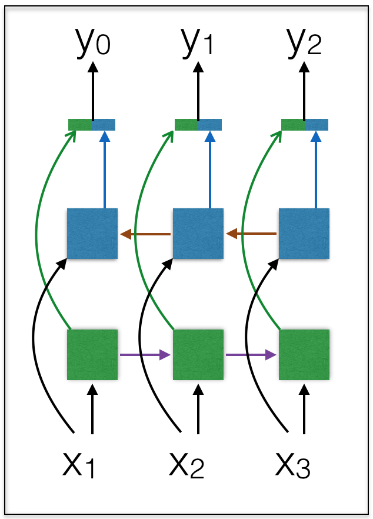

# bidirectional_RNN
bidirectional lstm

This repo demonstrates how to use [mozi](https://github.com/hycis/Mozi.git) to build a deep bidirectional RNN/LSTM with mlp layers before and after the LSTM layers

This repo can be used for the deep speech paper from Baidu

Deep Speech: Scaling up end-to-end speech recognition
arXiv:1412.5567, 2014
A. Hannun etc


<!--  -->


The figure above shows the structure of the Bidirectional LSTM, whereby you have one forward LSTM and one backward LSTM running in reverse time and with their features concatenated at the output layer, thus enabling informations from both past and future to come together.

```python
def train():
    max_features=20000
    maxseqlen = 100 # cut texts after this number of words (among top max_features most common words)
    batch_size = 16
    word_vec_len = 256
    iter_class = 'SequentialRecurrentIterator'
    seq_len = 10

    data = IMDB(pad_zero=True, maxlen=100, nb_words=max_features, batch_size=batch_size,
                train_valid_test_ratio=[8,2,0], iter_class=iter_class, seq_len=seq_len)

    print('Build model...')
    model = Sequential(input_var=T.matrix(), output_var=T.matrix())
    model.add(Embedding(max_features, word_vec_len))

    # MLP layers
    model.add(Transform((word_vec_len,))) # transform from 3d dimensional input to 2d input for mlp
    model.add(Linear(word_vec_len, 100))
    model.add(RELU())
    model.add(BatchNormalization(dim=100, layer_type='fc'))
    model.add(Linear(100,100))
    model.add(RELU())
    model.add(BatchNormalization(dim=100, layer_type='fc'))
    model.add(Linear(100, word_vec_len))
    model.add(RELU())
    model.add(Transform((maxseqlen, word_vec_len))) # transform back from 2d to 3d for recurrent input

    # Stacked up BiLSTM layers
    model.add(BiLSTM(word_vec_len, 50, output_mode='concat', return_sequences=True))
    model.add(BiLSTM(100, 24, output_mode='sum', return_sequences=True))
    model.add(LSTM(24, 24, return_sequences=True))

    # MLP layers
    model.add(Reshape((24 * maxseqlen,)))
    model.add(BatchNormalization(dim=24 * maxseqlen, layer_type='fc'))
    model.add(Linear(24 * maxseqlen, 50))
    model.add(RELU())
    model.add(Dropout(0.2))
    model.add(Linear(50, 1))
    model.add(Sigmoid())

    # build learning method
    decay_batch = int(data.train.X.shape[0] * 5 / batch_size)
    learning_method = SGD(learning_rate=0.1, momentum=0.9,
                          lr_decay_factor=1.0, decay_batch=decay_batch)

    # Build Logger
    log = Log(experiment_name = 'MLP',
              description = 'This is a tutorial',
              save_outputs = True, # log all the outputs from the screen
              save_model = True, # save the best model
              save_epoch_error = True, # log error at every epoch
              save_to_database = {'name': 'Example.sqlite3',
                                  'records': {'Batch_Size': batch_size,
                                              'Learning_Rate': learning_method.learning_rate,
                                              'Momentum': learning_method.momentum}}
             ) # end log

    # put everything into the train object
    train_object = TrainObject(model = model,
                               log = log,
                               dataset = data,
                               train_cost = mse,
                               valid_cost = error,
                               learning_method = learning_method,
                               stop_criteria = {'max_epoch' : 100,
                                                'epoch_look_back' : 5,
                                                'percent_decrease' : 0.01}
                               )
    # finally run the code
    train_object.setup()
    train_object.run()
```
